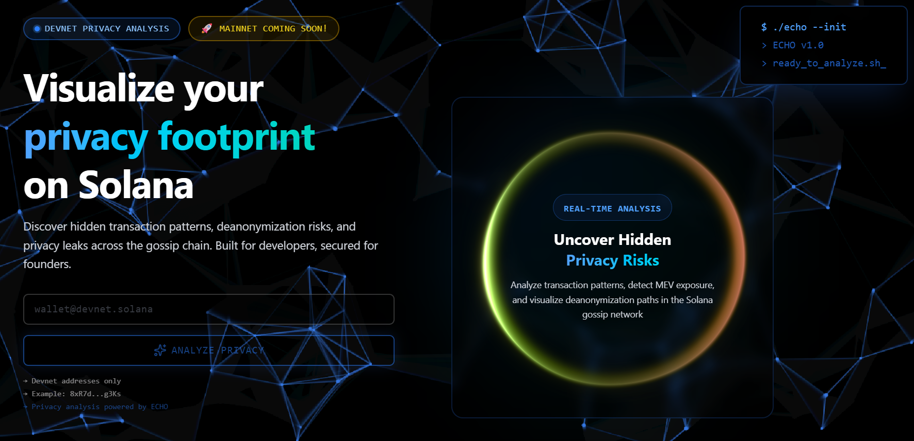

# 🔮 ECHO

> **Making Blockchain Privacy Risks Visible and Actionable**

<p align="center">
  
</p>

[](https://solana.com/privacyhack)
[](https://nextjs.org)
[](https://typescriptlang.org)
[](https://solana.com)
[](https://react.dev)
[](./tests)
[](./LICENSE)

<p align="center">
  <strong>🏆 Built for Solana Privacy Hackathon - Track 02: Privacy Tooling</strong>
</p>

<p align="center">
  <a href="#-the-problem">Problem</a> •
  <a href="#-the-solution">Solution</a> •
  <a href="#-features">Features</a> •
  <a href="#-quick-start">Quick Start</a> •
  <a href="#-sponsor-integrations">Sponsors</a> •
  <a href="#-demo">Demo</a>
</p>

---

## 📋 Table of Contents

- [The Problem](#-the-problem)
- [The Solution](#-the-solution)
- [Features](#-features)
  - [Privacy Analysis Engine](#1--privacy-analysis-engine)
  - [Interactive Graph Visualization](#2--interactive-graph-visualization)
  - [Node Detail Modal](#3--node-detail-modal)
  - [AI-Powered Privacy Summaries](#4--ai-powered-privacy-summaries)
  - [Privacy Simulation Panel](#5--privacy-simulation-panel)
  - [Gamification & Badges](#6--gamification--badges)
  - [Compliance Heatmap](#7--compliance-heatmap)
  - [Export Panel](#8--export-panel)
  - [API Logs Tab](#9--api-logs-tab)
- [Sponsor Integrations](#-sponsor-integrations)
- [Architecture](#-architecture)
- [Quick Start](#-quick-start)
- [Testing](#-testing)
- [Project Structure](#-project-structure)
- [Tech Stack](#-tech-stack)
- [Troubleshooting](#-troubleshooting)
- [Roadmap](#-roadmap)

---

## 🚨 The Problem

### Privacy on Solana is Broken — And Users Don't Even Know It

Blockchain's transparency is a double-edged sword. While it enables trustless verification, it also means:

- **Every transaction is permanently public** — Anyone can see your entire financial history
- **Wallet addresses become digital identities** — One exchange KYC links your real identity to ALL your transactions
- **Sophisticated actors exploit this** — MEV bots frontrun your trades, analytics firms profile your behavior
- **Users are privacy-blind** — Most people don't realize how exposed they are until it's too late

#### The Statistics Are Alarming:

| Claim | Impact |
|------|--------|
| **>$300M MEV extracted (lower bound)** | Value systematically siphoned from users via transaction ordering |
| **Solana MEV activity accelerating** | Priority fees & bundles indicate validator-level extraction |
| **Sandwich & frontrun attacks are common** | Retail traders receive worse execution |
| **Wallets deanonymized in few hops** | Identity & behavior leakage is structural |

### 📚 Verifiable On-Chain Evidence (Primary Sources)

All claims made above are backed by **public dashboards, on-chain analytics, or primary research**.

#### 🧠 MEV Is a Proven, Measurable Threat

**Ethereum (Baseline for MEV Research)**  
- Flashbots' comprehensive blockchain analysis classified **more than 1.3M MEV transactions and found at least $314M worth of Extracted MEV since January 1st, 2020**, plus $4.5M in wasted gas fees from failed MEV attempts.

**Proof (Primary Source):**
- Flashbots MEV Research: https://writings.flashbots.net/quantifying-mev/

**Solana (Rapidly Growing MEV Surface)**  
- **Jito Labs**, the largest block engine operator on Solana, launched the **first MEV dashboard for Solana**, confirming that MEV activity on Solana is **real, measurable, and growing**.

**Proof (Primary Source):**
- Jito Labs Solana MEV Dashboard: https://www.jito.wtf/blog/introducing-the-first-solana-mev-dashboard/

#### 🥪 Sandwich & Frontrunning Attacks Are Documented

- The **Solana Foundation removed validators for engaging in sandwich attacks** against retail users.

**Proof (Primary Sources):**
- https://www.coinmarketcal.com/ko/news/solana-foundation-expels-validators-for-sandwich-attacks-on-retail-users
- https://www.cointelegraph.com/news/solana-removes-validators-sandwich-attacks

### Why This Matters for Track 02: Privacy Tooling

> *"Develop tools and infrastructure that make it easier for developers to build with privacy on Solana."*

**The gap**: Before developers can BUILD privacy tools, users need to UNDERSTAND their current privacy state. You can't fix what you can't see.

**ECHO fills this gap** — It's the diagnostic layer that makes privacy risks visible, quantifiable, and actionable.

---

## 💡 The Solution

### ECHO: The First Privacy Intelligence Platform for Solana

ECHO is a **real-time privacy analysis and visualization tool** that:

1. **Diagnoses** — Analyzes any wallet's privacy exposure across 8 risk categories
2. **Visualizes** — Renders transaction relationships as an interactive graph with **12 most relevant connections**
3. **Quantifies** — Calculates a 0-100 privacy score using weighted risk algorithms
4. **Educates** — Explains risks in plain language via AI-powered summaries (Gemini 2.5 Flash)
5. **Simulates** — Shows how privacy techniques would improve your score
6. **Detects MEV** — Identifies sandwich attacks, frontrunning, and extractive patterns

### 🏆 Unique Selling Points (USP)

| Feature | ECHO | Other Tools |
|---------|------|-------------|
| **Multi-API Privacy Analysis** | ✅ Helius + Range + QuickNode + Gemini | ❌ Single source |
| **MEV Pattern Detection** | ✅ Sandwich/frontrun patterns with visual indicators | ❌ Not available |
| **Interactive Graph Visualization** | ✅ React Flow with risk-colored nodes & edges | ❌ Static tables |
| **Clickable Node Details** | ✅ Modal with risk explanation, confidence, transaction count | ❌ No details |
| **AI-Powered Explanations** | ✅ Gemini 2.5 Flash natural language summaries | ❌ Technical jargon |
| **Privacy Score Algorithm** | ✅ Weighted 8-category scoring (0-100) | ❌ Binary pass/fail |
| **"What If" Simulations** | ✅ Privacy technique impact preview | ❌ No simulations |
| **Sanctions/Compliance Check** | ✅ Range Protocol OFAC screening | ❌ Manual lookup |
| **Real Transaction Data** | ✅ Actual transaction counts per address | ❌ Mock/placeholder |
| **Open Source** | ✅ MIT Licensed | ❌ Proprietary |

---

## ⚠️ Current Status

<p align="center">
  
  
</p>

Currently deployed on **Solana Devnet** for safe testing.

---

## ✨ Features

### 1. 🔍 Privacy Analysis Engine

**File**: `lib/privacy-engine.ts`

The core engine analyzes wallets across **8 risk categories**:

| Category | Detection Method | Why It Matters |
|----------|-----------------|----------------|
| **KYC Exchange Links** | Helius connected addresses → known exchange list | One exchange = your identity is linked to ALL transactions |
| **Temporal Patterns** | Transaction timestamps → hour clustering | Reveals timezone, sleep schedule, work hours |
| **Amount Correlation** | Recurring transfer amounts | Salary payments, subscriptions become identifiable |
| **Repeat Interactions** | Address frequency analysis | Regular contacts = relationship mapping |
| **MEV Exposure** | QuickNode tx analysis → sandwich detection | You're being exploited by bots |
| **Compliance Risk** | Range Protocol OFAC/blacklist check | Legal exposure from tainted funds |
| **Token Risk** | Range token assessment | Scam/rugpull token interaction |
| **Network Clustering** | Graph analysis → common counterparties | Sybil detection, identity correlation |

#### Privacy Score Algorithm

```
Privacy Score = 100 - Σ(Risk Weight × Severity Multiplier)
```

**Severity Multipliers**:

| Severity | Multiplier | Rationale |
|----------|------------|-----------|
| Critical | 25 | Immediate identity exposure (exchange link, sanctions) |
| High | 15 | Significant deanonymization risk (temporal patterns) |
| Medium | 8 | Moderate correlation risk (repeat interactions) |
| Low | 3 | Minor fingerprinting (amount patterns) |

#### Confidence Scoring

Each detected risk includes a confidence percentage based on actual transaction data:

```typescript
confidence = Math.min(95, 40 + (transactionsWithPattern × 11))
```

- **40% base**: Minimum confidence with any detection
- **11% per transaction**: Each additional pattern occurrence increases confidence
- **95% cap**: Never claim 100% certainty (blockchain analysis has limits)

---

### 2. 📊 Interactive Graph Visualization

**File**: `components/gossip-graph.tsx`

Built with **React Flow** for a fully interactive deanonymization network:

#### Key Features:
- **12 Most Relevant Connections**: Displays top 12 connected addresses for visual clarity (all addresses analyzed for scoring)
- **Click Any Node**: Opens detailed modal with risk explanation
- **Drag & Pan**: Full interactivity with zoom controls
- **Live Edge Animation**: Animated connections showing transaction flow
- **Risk-Colored Edges**: Green/Yellow/Red based on confidence level

#### Node Types & Colors

| Node Type | Color | Icon | Meaning |
|-----------|-------|------|---------|
| **Your Wallet** | Blue Ring | 👤 | The analyzed address (center) |
| **Regular Wallet** | Gray | 💳 | Standard interaction |
| **Exchange** | Red | 🏦 | KYC risk — identity link |
| **Program** | Purple | ⚙️ | Smart contract (System, Token, Jupiter, etc.) |
| **MEV Bot** | Orange | 🤖 | Extractive actor detected |

#### MEV Attack Badges

When MEV is detected, nodes display attack type badges:

| Badge | Attack Type | Description |
|-------|-------------|-------------|
| 🥪 | Sandwich | Your trade was sandwiched (buy before, sell after) |
| 🏃 | Frontrun | Bot detected your pending tx and front-ran it |
| 🔙 | Backrun | Bot executed immediately after your tx |
| ⚡ | JIT | Just-in-time liquidity manipulation |

#### Known Program Detection

The graph automatically detects and labels known Solana programs:
- `11111111111111111111111111111111` — System Program
- `TokenkegQfeZyiNwAJbNbGKPFXCWuBvf9Ss623VQ5DA` — Token Program
- `ATokenGPvbdGVxr1b2hvZbsiqW5xWH25efTNsLJA8knL` — Associated Token Program
- `metaqbxxUerdq28cj1RbAWkYQm3ybzjb6a8bt518x1s` — Metaplex
- `JUP6LkbZbjS1jKKwapdHNy74zcZ3tLUZoi5QNyVTaV4` — Jupiter
- `whirLbMiicVdio4qvUfM5KAg6Ct8VwpYzGff3uctyCc` — Orca Whirlpool
- `9W959DqEETiGZocYWCQPaJ6sBmUzgfxXfqGeTEdp3aQP` — Raydium

---

### 3. 🔎 Node Detail Modal

**File**: `components/node-detail-modal.tsx`

Click any node in the graph to open a compact, informative modal:

#### Information Displayed:
- **Address**: Full address with copy-to-clipboard button
- **Risk Level**: Low/Medium/High/Critical with color coding
- **Confidence Score**: How certain the analysis is (based on transaction count)
- **Transaction Count**: Real number of transactions with this address
- **Node Type**: Wallet, Exchange, Program, or MEV Bot
- **External Link**: Direct link to Solana Explorer

#### Risk Level Explanations:

| Level | Color | Description |
|-------|-------|-------------|
| **Low** | 🟢 Green | Minimal privacy concerns, safe interaction |
| **Medium** | 🟡 Yellow | Some traceable patterns, consider privacy tools |
| **High** | 🔴 Red | Significant deanonymization risk, minimize interactions |
| **Critical** | 🔴 Red (pulsing) | Strong identity exposure, avoid further contact |

#### Transparency Section:
Each modal shows exactly how the confidence was calculated:
- For your wallet: "Analyzed X total transactions from your wallet"
- For connected addresses: "X direct transactions detected with this address"
- Confidence is based on transaction frequency, not random data

---

### 4. 🤖 AI-Powered Privacy Summaries

**File**: `lib/api/gemini.ts`

Uses **Google Gemini 2.5 Flash** for natural language explanations.

#### Why Gemini 2.5 Flash?

| Model | Speed | Cost | Quality | Our Choice |
|-------|-------|------|---------|------------|
| GPT-4 | Slow | $$$ | Excellent | ❌ Too slow for real-time |
| GPT-3.5 | Fast | $ | Good | ❌ Less nuanced |
| Claude 3 | Medium | $$ | Excellent | ❌ Higher latency |
| **Gemini 2.5 Flash** | ⚡ Fast | Free tier | Great | ✅ Best speed/quality/cost |

#### What AI Provides:
- **2-Sentence Summary**: Plain English overview of privacy state
- **Biggest Risk**: The single most important issue to address
- **Actionable Recommendation**: One concrete step to improve privacy
- **Privacy Assessment**: Categorized as Poor/Fair/Good/Excellent

---

### 5. 🛡️ Privacy Simulation Panel

**File**: `components/simulation-panel.tsx`

"What If?" scenarios showing how privacy techniques would improve scores:

| Technique | Score Impact | How It Helps |
|-----------|--------------|--------------|
| **Address Rotation** | +20 pts | New address per tx prevents pattern analysis |
| **Timing Randomization** | +15 pts | Random delays eliminate temporal fingerprints |
| **Transaction Batching** | +12 pts | Combine txs to obscure amount correlation |
| **Decoy Transactions** | +10 pts | Noise txs increase anonymity set |

Each simulation shows:
- Current score vs. simulated score
- Visual progress bar comparison
- Detailed explanation of the technique

---

### 6. 🎮 Gamification & Badges

**File**: `components/gamification-badges.tsx`

Achievement badges to encourage privacy improvement:

| Badge | Requirement | Description |
|-------|-------------|-------------|
| 🥷 Shadow Master | 90+ privacy score | Peak privacy achieved |
| 👻 Ghost Mode | No critical risks | Clean risk profile |
| 🐋 Whale Watcher | 100+ transactions | Active trader |
| 🎯 MEV Immune | No MEV exposure | Protected from extraction |
| 🌙 Night Owl | Late-night transactions | Temporal diversity |

---

### 7. 📋 Compliance Heatmap

**File**: `components/compliance-heatmap.tsx`

Visual breakdown of risk distribution across categories:

```
Identity    ████████░░  80%  ← Highest risk
Temporal    ██████░░░░  60%
MEV         ████░░░░░░  40%
Regulatory  ██░░░░░░░░  20%
Amount      █░░░░░░░░░  10%
Network     █░░░░░░░░░  10%
```

Color-coded bars show which risk categories need the most attention.

---

### 8. 📥 Export Panel

**File**: `components/export-panel.tsx`

Export your analysis results in multiple formats:

| Format | Use Case |
|--------|----------|
| **JSON** | Programmatic processing, API integration |
| **Markdown** | Documentation, reports, sharing |
| **CSV** | Spreadsheet analysis, data processing |

Exports include:
- Full privacy score and breakdown
- All detected risks with severity
- Transaction count and unique interactions
- AI summary and recommendations
- Timestamp of analysis

---

### 9. 📟 API Logs Tab

**File**: `components/analysis-sidebar.tsx` (Logs tab)

Real-time visibility into API calls made during analysis:

- **Helius API calls**: Transaction fetching, connected addresses
- **Range Protocol calls**: Risk scoring, sanctions check
- **QuickNode calls**: MEV detection
- **Gemini AI calls**: Summary generation
- **Response times**: Performance metrics for each call

---

## 🔌 Sponsor Integrations

ECHO integrates **4 sponsor technologies** for comprehensive privacy analysis:

### 1. 📡 Helius — Transaction Intelligence

**Website**: [helius.dev](https://helius.dev)

**What it provides**:
- Full transaction history for any Solana wallet
- Connected addresses (all wallets that interacted)
- Enhanced parsed transaction data
- Token balances and transfers

**API Endpoints Used**:
```typescript
// Transaction history with enhanced parsing
POST https://api.helius.xyz/v0/addresses/{address}/transactions

// Connected addresses for graph building
GET https://api.helius.xyz/v0/addresses/{address}/balances

// Enhanced RPC
https://devnet.helius-rpc.com/?api-key={API_KEY}
```

**Integration Points**:
- Privacy Engine: Fetches all transactions for risk analysis
- Graph Builder: Extracts counterparty addresses for visualization
- Temporal Analysis: Uses timestamps for pattern detection
- Transaction Count: Real counts displayed in node modals

---

### 2. 🛡️ Range Protocol — Risk & Compliance

**Website**: [range.org](https://range.org)

**What it provides**:
- 0-10 risk score with detailed reasoning
- OFAC sanctions list screening
- Token blacklist checking
- Malicious address detection

**API Endpoints Used**:
```typescript
// Risk scoring with hop analysis
POST https://api.range.org/platform/v1/risk/score/getAddressRiskScore

// Sanctions and blacklist check
POST https://api.range.org/platform/v1/risk/score/checkSanctions

// Token risk assessment
POST https://api.range.org/platform/v1/risk/score/assessTokenRisk
```

**Risk Score Mapping**:
- 0-3: Low risk (green in UI)
- 4-6: Medium risk (yellow)
- 7-10: High risk (red, triggers critical alert)

---

### 3. ⚡ QuickNode — High-Performance RPC & MEV Detection

**Website**: [quicknode.com](https://quicknode.com)

**What it provides**:
- High-performance Solana RPC endpoint
- Transaction-level MEV pattern detection
- Balance change analysis for sandwich detection

**MEV Detection Logic**:
```typescript
// Sandwich detection: Same address profits at start AND end of block
const isSandwich = firstAccountGain > 0 && lastAccountGain > 0 && sameAddress;

// Frontrun detection: Large balance gain before target tx
const isFrontrun = balanceChangeBeforeTx > 1_000_000_000; // >1 SOL
```

---

### 4. 🧠 Google Gemini AI — Privacy Explanations

**Website**: [ai.google.dev](https://ai.google.dev)

**What it provides**:
- Natural language privacy risk explanations
- Personalized recommendations
- Technical → Plain English translation

**API Endpoint**:
```typescript
POST https://generativelanguage.googleapis.com/v1beta/models/gemini-2.0-flash-exp:generateContent
```

**Model**: `gemini-2.0-flash-exp` (optimized for speed)

---

## 🏗️ Architecture

```
┌─────────────────────────────────────────────────────────────────────────┐
│                           ECHO Privacy Intelligence                      │
├─────────────────────────────────────────────────────────────────────────┤
│  ┌─────────────┐  ┌─────────────┐  ┌─────────────┐  ┌─────────────────┐ │
│  │   Landing   │  │  Analysis   │  │    Graph    │  │     Sidebar     │ │
│  │    Page     │→ │    Page     │→ │  (React     │← │  (6 Tabs)       │ │
│  │  (Orb.tsx)  │  │ [address]   │  │    Flow)    │  │                 │ │
│  └─────────────┘  └─────────────┘  └─────────────┘  └─────────────────┘ │
│                                           ↓                              │
│                              ┌─────────────────────┐                     │
│                              │  Node Detail Modal  │                     │
│                              │  (Click any node)   │                     │
│                              └─────────────────────┘                     │
└───────────────────────────┬─────────────────────────────────────────────┘
                            │
                   ┌────────▼────────┐
                   │  API Routes     │
                   │  /api/analyze   │
                   └────────┬────────┘
                            │
              ┌─────────────▼─────────────┐
              │   Privacy Analysis Engine  │
              │   lib/privacy-engine.ts    │
              │   • Risk Detection         │
              │   • Score Calculation      │
              │   • Path Building          │
              │   • Transaction Counting   │
              └─────────────┬──────────────┘
                            │
    ┌───────────┬───────────┼───────────┬───────────┐
    │           │           │           │           │
┌───▼───┐  ┌────▼────┐  ┌───▼───┐  ┌────▼────┐
│HELIUS │  │  RANGE  │  │QUICK  │  │ GEMINI  │
│       │  │PROTOCOL │  │ NODE  │  │   AI    │
│ Txs   │  │  Risk   │  │  MEV  │  │Summary  │
└───────┘  └─────────┘  └───────┘  └─────────┘
```

### Sidebar Tabs:
1. **Overview** — Privacy score, risks, AI summary
2. **Simulate** — "What if" privacy technique simulations
3. **Heatmap** — Risk distribution visualization
4. **Badges** — Gamification achievements
5. **API Logs** — Real-time API call visibility
6. **Export** — JSON/Markdown/CSV export

---

## 🚀 Quick Start

### Prerequisites

- **Node.js 18+** and npm
- **API Keys** from sponsors (all have free tiers)

### Installation

```bash
# Clone the repository
git clone https://github.com/Shawnchee/ECHO.git
cd ECHO

# Install dependencies
npm install

# Copy environment template
cp .env.example .env
```

### Configure API Keys

Edit `.env` with your API keys:

```bash
# Helius - Transaction Data (Required)
HELIUS_API_KEY=your_helius_api_key

# Range Protocol - Risk Scoring (Required)
RANGE_API_KEY=your_range_api_key

# QuickNode - MEV Detection (Optional, falls back to public RPC)
QUICKNODE_API_URL=https://your-endpoint.quiknode.pro/YOUR_KEY/

# Gemini AI - Privacy Summaries (Required)
GEMINI_API_KEY=your_gemini_api_key

# Network Configuration
NEXT_PUBLIC_SOLANA_NETWORK=devnet
```

### Get Free API Keys

| Service | Sign Up | Free Tier |
|--------|---------|-----------|
| [Helius](https://helius.dev) | ✅ Easy | 1,000,000 credits/month |
| [Range](https://range.org) | ✅ Easy | 100 requests/month |
| [QuickNode](https://quicknode.com) | ✅ Easy | ~10M API credits/month |
| [Gemini AI](https://ai.google.dev) | ✅ Easy | Free tier with RPM limits |

### Run Development Server

```bash
npm run dev
```

Open [http://localhost:3000](http://localhost:3000)

### Production Build

```bash
npm run build
npm start
```

---

## 🧪 Testing

### Test Suite Overview

**11 tests across 4 test classes:**

| Test Class | Tests | Coverage |
|------------|-------|----------|
| `TestAnalyzeEndpoint` | 4 | API validation, response structure, error handling |
| `TestShadowWireEndpoint` | 3 | Balance check, transfer simulation, invalid actions |
| `TestHealthCheck` | 2 | Endpoint availability, homepage load |
| `TestDataValidation` | 2 | Score ranges, severity values |

### Run Tests

```bash
# Install test dependencies
pip install -r tests/requirements.txt

# Run all tests
pytest tests/test_api.py -v

# Run specific test class
pytest tests/test_api.py::TestAnalyzeEndpoint -v
```

### Test Wallets (Devnet)

```
# Active wallet with transaction history
DRpbCBMxVnDK7maPM5tGv6MvB3v1sRMC86PZ8okm21hy

# System program (edge case testing)
11111111111111111111111111111111
```

---

## 📁 Project Structure

```
ECHO/
├── app/                          # Next.js 16 App Router
│   ├── page.tsx                  # Landing page with animated Orb
│   ├── layout.tsx                # Root layout with providers
│   ├── globals.css               # Tailwind CSS styles
│   ├── analysis/
│   │   └── [address]/
│   │       └── page.tsx          # Analysis results page
│   ├── api/
│   │   ├── analyze/route.ts      # Main privacy analysis endpoint
│   │   └── shadowwire/route.ts   # ShadowWire integration endpoint
│   └── components/
│       └── providers.tsx         # React context providers
├── components/
│   ├── ui/                       # shadcn/ui components (button, input, etc.)
│   ├── Orb.tsx                   # WebGL animated orb (landing page)
│   ├── Orb.css                   # Orb styling
│   ├── analysis-sidebar.tsx      # 6-tab results panel
│   ├── gossip-graph.tsx          # React Flow graph visualization
│   ├── graph-nodes.tsx           # Custom node type components
│   ├── node-detail-modal.tsx     # Node click detail modal
│   ├── simulation-panel.tsx      # "What If?" privacy simulator
│   ├── compliance-heatmap.tsx    # Risk category breakdown
│   ├── gamification-badges.tsx   # Achievement badges
│   ├── terminal-header.tsx       # Floating status bar
│   ├── wallet-input.tsx          # Address input form
│   └── export-panel.tsx          # JSON/Markdown/CSV export
├── lib/
│   ├── privacy-engine.ts         # Core analysis logic (441 lines)
│   ├── api/
│   │   ├── helius.ts             # Helius transaction fetching
│   │   ├── range.ts              # Range risk & sanctions
│   │   ├── quicknode.ts          # QuickNode MEV detection
│   │   └── gemini.ts             # Gemini AI summaries
│   ├── solana.ts                 # Solana utilities
│   └── utils.ts                  # Helper functions
├── tests/
│   ├── test_api.py               # 11 Pytest integration tests
│   └── requirements.txt          # Test dependencies
├── public/                       # Static assets
├── .env.example                  # Environment template
├── pytest.ini                    # Pytest configuration
├── next.config.ts                # Next.js configuration
├── tsconfig.json                 # TypeScript configuration
├── tailwind.config.ts            # Tailwind CSS configuration
└── package.json                  # Dependencies & scripts
```

---

## 🛠️ Tech Stack

### Frontend
| Technology | Version | Purpose |
|------------|---------|---------|
| **Next.js** | 16.0.10 | React framework with App Router |
| **React** | 19.2.3 | UI library |
| **TypeScript** | 5.x | Type safety |
| **Tailwind CSS** | 4.x | Styling |
| **React Flow** | 11.11.4 | Graph visualization |
| **Framer Motion** | 12.26.2 | Animations |
| **Lucide React** | 0.562.0 | Icons |
| **OGL** | 1.0.11 | WebGL for Orb animation |

### Backend / APIs
| Service | Purpose |
|---------|---------|
| **Helius** | Transaction history, connected addresses |
| **Range Protocol** | Risk scoring, OFAC sanctions |
| **QuickNode** | High-performance RPC, MEV detection |
| **Gemini AI** | Natural language summaries |

### Testing
| Technology | Purpose |
|------------|---------|
| **Pytest** | Python test framework |
| **Requests** | HTTP client for API tests |

---

## 🛠️ Troubleshooting

### Common Issues

| Issue | Cause | Solution |
|-------|-------|----------|
| `Range API rate limited` | >100 requests/month | Built-in 60s cache, wait or upgrade |
| `Gemini 404 error` | Invalid API key | Regenerate at ai.google.dev |
| `Empty graph` | Wallet has no history | Try different Devnet wallet |
| `Transaction count shows 0` | New wallet | Wallet needs transaction history |
| `CORS errors` | Local development | Use `npm run dev` (includes proxy) |

### Test Wallet for Demo

If you need a wallet with activity for testing:
```
DRpbCBMxVnDK7maPM5tGv6MvB3v1sRMC86PZ8okm21hy
```

---

## 🗺️ Roadmap

### Phase 1: Hackathon (Current) ✅
- [x] Privacy analysis engine with 8 risk categories
- [x] Interactive graph visualization (React Flow)
- [x] Node detail modals with real transaction data
- [x] AI-powered summaries (Gemini)
- [x] MEV detection with visual indicators
- [x] Privacy simulation panel
- [x] Gamification badges
- [x] Compliance heatmap
- [x] Export functionality (JSON/Markdown/CSV)
- [x] 11 passing tests

### Phase 2: Post-Hackathon (Q1 2026)
- [ ] Mainnet support (with safeguards)
- [ ] Wallet adapter integration (Phantom, Solflare)
- [ ] Privacy-preserving transfer integrations
- [ ] Historical privacy score tracking

### Phase 3: Growth (Q2-Q3 2026)
- [ ] Public API for developers
- [ ] Browser extension
- [ ] Telegram/Discord bot
- [ ] Multi-chain support (Ethereum, Polygon)

---

## 🎥 Demo

### How to Use ECHO:

1. **Visit the landing page** — See the animated Orb visualization
2. **Enter any Solana address** — Devnet addresses work best for testing
3. **Wait for analysis** — ~5-10 seconds for full analysis
4. **Explore the graph** — Click and drag nodes, zoom in/out
5. **Click any node** — See detailed risk explanation
6. **Check sidebar tabs** — Overview, Simulate, Heatmap, Badges, Logs, Export

### Sample Addresses for Testing:

```bash
# Active Devnet wallet (recommended)
DRpbCBMxVnDK7maPM5tGv6MvB3v1sRMC86PZ8okm21hy

# System Program (edge case)
11111111111111111111111111111111
```

---

## 👨‍💻 Author

**Shawn Chee**

[](https://linkedin.com/in/shawnchee)
[](https://github.com/shawnchee)

---

## 📄 License

This project is licensed under the **MIT License** — see [LICENSE](LICENSE) for details.

---

## 🙏 Acknowledgments

Built with support from hackathon sponsors:

| Sponsor | Contribution |
|---------|--------------|
| **Helius** | Transaction indexing & connected addresses API |
| **Range Protocol** | Risk scoring & compliance screening |
| **QuickNode** | High-performance RPC & MEV detection |
| **Google** | Gemini AI for privacy summaries |

---

<p align="center">
  <strong>🔮 ECHO — Making the Invisible Visible</strong>
  <br>
  <em>Because privacy isn't about hiding. It's about choosing what to reveal.</em>
</p>
